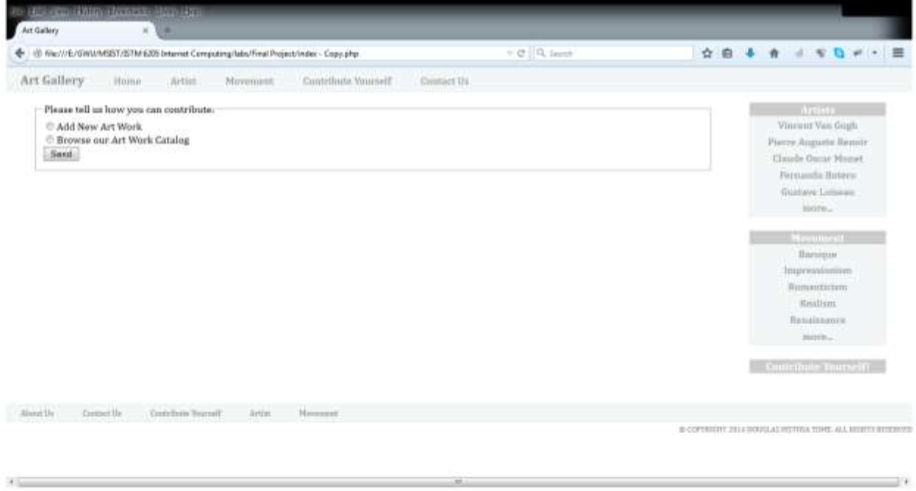
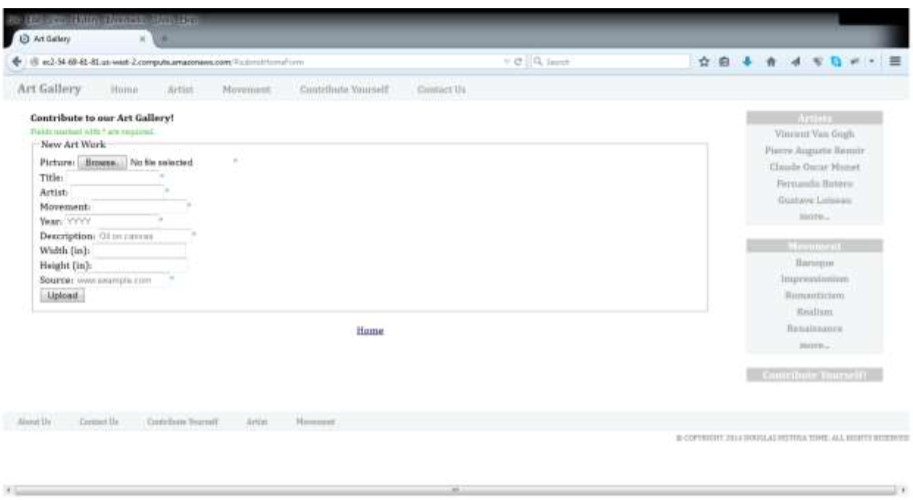
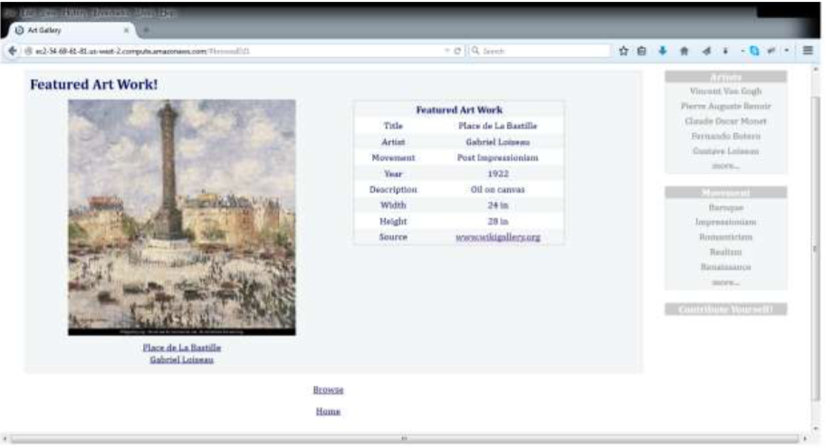
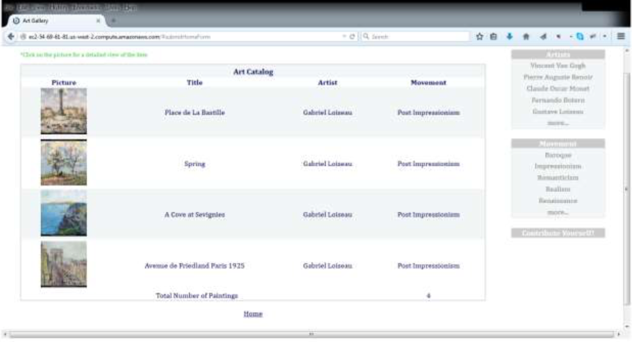

# GWMSIST

## Project I Requirements

### Project Description

The goal of the first student project is to develop a web application that is able to validate user input and to display content to the user in a table format.

This assignment consists of a web application that has, at a minimum, three different pages:

1. The first page is your web application homepage. The primary goal of the homepage is to provide links to other pages on your website. Specifically, the homepage must provide a link to the two other pages described below. The homepage should also have the general layout (e.g., top navigation bar, bottom navigation bar, side items) of your web application. Note that not all links included on your homepage need to actually work (i.e., they may point to "#"). However, the links to the pages described below must work.

2. The second web page displays a user input form. The form must contain at least five input fields and it must point to the following url: `http://www.randyconnolly.com/tests/process.php`

 Once the user submits the form, the user input data must be validated using client-side scripting (i.e., Javascript). If the user input data is valid, the form should be submitted. If the user input data is not valid, the form should not be submitted and the input fields that have invalid data should be pointed out to the user. This page should have a link for the user to return to the homepage in case they so desire.

3. The third web page displays content to the user in a table format. The table columns and the user input form fields (from the previous page) must match. The data on the table is static. In other words, the content of the table is predefined by you as the web developer. The user is not able to change the content of the table at this point. Alternatively, you may create multiple pages to perform the same functions as the single page described previously. In this case, a central page displays content to the user in a table format but omits some user input form fields (e.g., to display all the fields at the same time would compromise the page layout due to excessive number of columns). The table on the central page should have links that direct the user to another page in which a single item of the original table is featured. These individual pages should have all the user input form fields. In either case (i.e., a single page or a central page with multiple individual- item pages), there should be a link for the user to return to the previous page in case they so desire.

The result of this project should ideally be used in your second project. The second student project will consist of a dynamic web application that is able to store user input in a database as well as update, retrieve, and delete items in such database. Therefore, the user input form and the

table that you develop in the first project should be used in the second project to gather data to be stored in the database and to display the items retrieved in the database to the user, respectively.

###Grading Criteria

* Homepage: 10%
* User input form page: 20%
* User input validation: 20%
* Content (table-format) page(s): 20%
* Semantic markup (CSS and Javascript separate from HTML): 15%
* Responsive design (mobile, tablet, and desktop layouts): 15%

Your work will be evaluated based on the quality of your solution in terms of the criteria specified above. You are expected to adhere to web development best practices (as outlined in the textbook). The brief description of your web application provided by you (as specified below) will serve to clarify the application functionality.

###Submission Instrutions
You must submit** all the files** you created/used in your web application and a **Word document** that describes the functionality of your application. The submitted files include:
* HTML file(s)
* CSS file(s)
* Javascript file(s)
* Any other file you may have used (e.g., image files)

The Word document should briefly describe the functionality of your web application. It should be a concise document that explains what you did (e.g., user input form validation) and how you did it (e.g., which fields are mandatory and which ones are optional, what are the validation rules for each field). In this description, do not focus on the code you wrote (since you will also submit the files you created), but on the functionality of your application. Functionalities that are not documented will not be considering when evaluating your work.

###Example Project
The following are screenshots of an example project. Note that these are intended to provide you an idea of how a web application could be designed to meet the above project description. However, this example project is by no means the only or the preferred way to develop your web application. You are expected to exercise creativity and critical judgment to develop your own web application. Remember that the quality of your solution will be taken into account when evaluating your work, as specified in the grading criteria above.

* Homepage

* User input form page

* Content (table-format) page(s)

